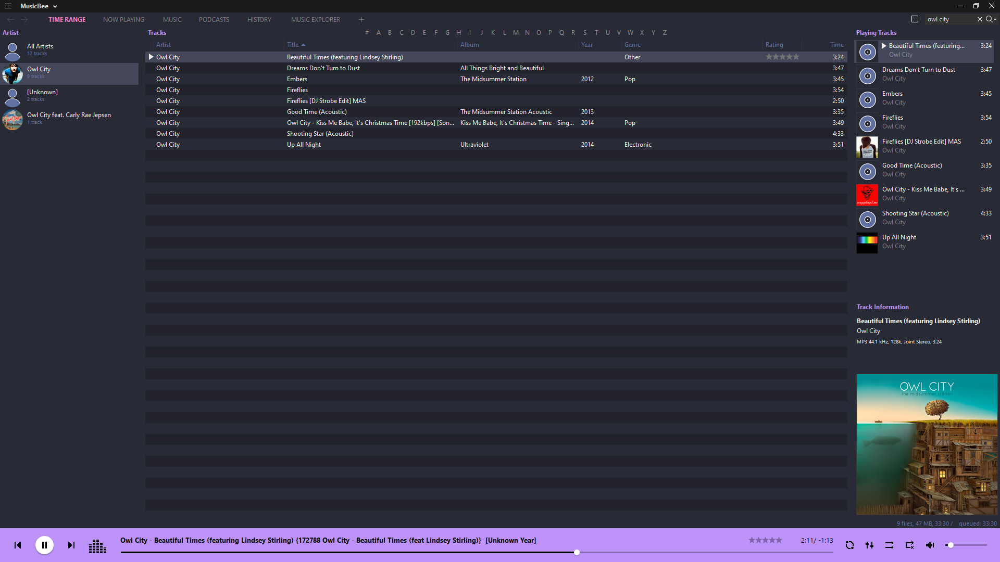

# Dracula for [MusicBee](https://www.getmusicbee.com/)

> A dark theme for [MusicBee](https://www.getmusicbee.com/).

## Install

All instructions can be found at [INSTALL](INSTALL.md).

## Team

This theme is maintained by the following person(s) and a bunch of [awesome contributors](https://github.com/mly32/Dracula-MusicBee/graphs/contributors).
|  |
| --- |
| [Michael Ye](https://github.com/mly32) |

## Skin Template

This MusicBee skin was based off of [MaterialMix](https://getmusicbee.com/addons/skins/203/materialmix-hidpi-supported/) by [diego](https://getmusicbee.com/forum/index.php?action=profile;u=39481)

## License

[cc by-sa 3.0](https://creativecommons.org/licenses/by-sa/3.0/)
[MIT License](./LICENSE)
