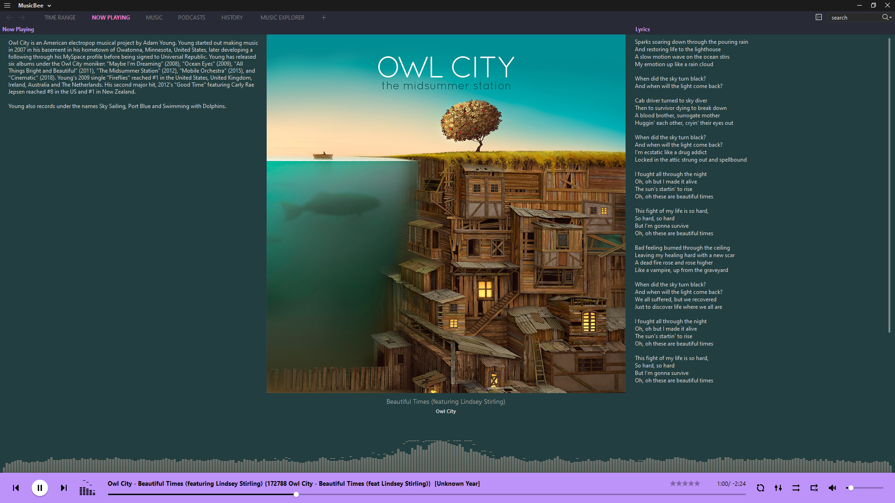

# Dracula for [MusicBee](https://www.getmusicbee.com/)

> A dark theme for [MusicBee](https://www.getmusicbee.com/).

## Install

All instructions can be found at [draculatheme.com/musicbee](https://draculatheme.com/musicbee).

## Team

This theme is maintained by the following person(s) and a bunch of [awesome contributors](https://github.com/dracula/musicbee/graphs/contributors).

|  |  |
| :----------------------------------------------------------------------------------------------------------------------------: | :--------------------------------------------------------------------------------------------------------------------------------------: |
|                                             [Michael Ye](https://github.com/mly32)                                             |                                             [Diego Sergio](https://github.com/diego-sergio)                                              |

## Skin Template

This MusicBee skin was based off of [MaterialMix](https://getmusicbee.com/addons/skins/203/materialmix-hidpi-supported/) by [diego](https://getmusicbee.com/forum/index.php?action=profile;u=39481)

## Community

- [Twitter](https://twitter.com/draculatheme) - Best for getting updates about themes and new stuff.
- [GitHub](https://github.com/dracula/dracula-theme/discussions) - Best for asking questions and discussing issues.
- [Discord](https://draculatheme.com/discord-invite) - Best for hanging out with the community.

## License

[cc by-sa 3.0](https://creativecommons.org/licenses/by-sa/3.0/)

[MIT License](./LICENSE)
